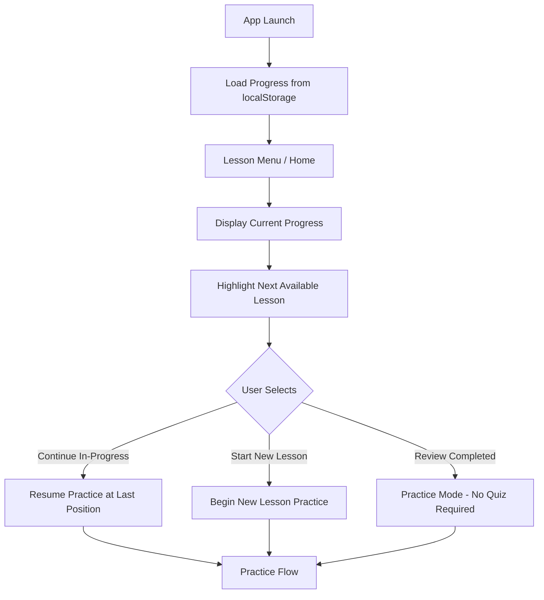
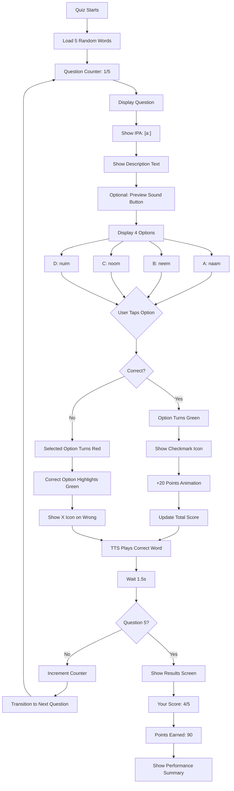
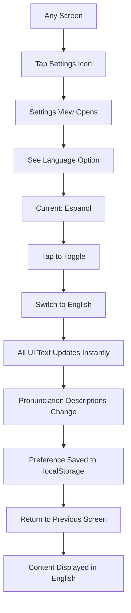
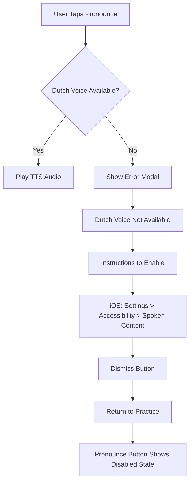
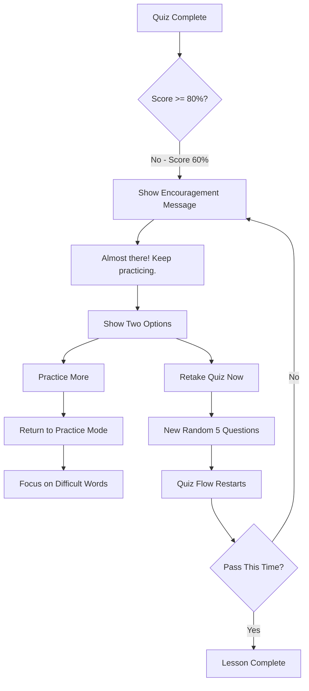

# User Flows
## Dutch Pronunciation Learning App - Flip Cards

**Document Version:** 1.0
**Date:** 2026-01-29
**Status:** Design Specification

---

## 1. Overview

This document maps the primary user journeys through the Dutch pronunciation learning app. Each flow is designed for intuitive navigation with minimal friction, supporting the Duolingo-inspired gamification model.

---

## 2. High-Level Navigation Architecture

```
                    ┌─────────────────┐
                    │   App Launch    │
                    └────────┬────────┘
                             │
                    ┌────────▼────────┐
                    │  First Visit?   │
                    └────────┬────────┘
                       Yes   │   No
                    ┌────────┴────────┐
                    ▼                 ▼
            ┌───────────────┐  ┌───────────────┐
            │  Onboarding   │  │  Lesson Menu  │
            │    (Phase 2)  │  │    (Home)     │
            └───────┬───────┘  └───────┬───────┘
                    │                  │
                    └────────┬─────────┘
                             │
        ┌────────────────────┼────────────────────┐
        │                    │                    │
        ▼                    ▼                    ▼
┌───────────────┐    ┌───────────────┐    ┌───────────────┐
│   Practice    │    │  Achievements │    │   Settings    │
│     View      │    │     View      │    │     View      │
└───────────────┘    └───────────────┘    └───────────────┘
```

---

## 3. Primary User Flows

### 3.1 Flow A: First Lesson Completion

**Goal:** New user completes their first lesson and earns "First Steps" badge

```mermaid
flowchart TD
    A[App Launch] --> B[Lesson Menu / Home]
    B --> C[Select "aa" Beginner]
    C --> D[Practice View Loads]

    D --> E[View First Word: naam]
    E --> F{User Action}

    F -->|Tap Center Card| G[Flip to Pronunciation Guide]
    G --> H[View IPA + Description]
    H --> I{Tap Pronounce?}
    I -->|Yes| J[TTS Plays Sound]
    J --> K[Tap Center to Flip Back]
    I -->|No| K

    K --> L{Mark Difficulty}
    L -->|Got it| M[Mark as Easy]
    L -->|Need practice| N[Mark as Difficult]
    L -->|Skip| O[No Mark]

    M --> P{More Words?}
    N --> P
    O --> P

    P -->|Yes| Q[Show Next Word]
    Q --> F

    P -->|No - All seen 3x| R[Quiz Available]
    R --> S[Begin Quiz]

    S --> T[Question 1 of 5]
    T --> U[Display IPA + Description]
    U --> V[Show 4 Options]
    V --> W{User Selects}

    W -->|Correct| X[Show Green Check + 20pts]
    W -->|Incorrect| Y[Show Red X + Correct Answer]

    X --> Z[TTS Plays Pronunciation]
    Y --> Z

    Z --> AA{More Questions?}
    AA -->|Yes| AB[Next Question]
    AB --> T

    AA -->|No| AC[Quiz Complete]
    AC --> AD{Score >= 80%?}

    AD -->|Yes| AE[Lesson Complete!]
    AE --> AF[Celebration Animation]
    AF --> AG[Award "First Steps" Badge]
    AG --> AH[Show Badge Unlock Animation]
    AH --> AI[Return to Lesson Menu]

    AD -->|No| AJ[Encourage Retry]
    AJ --> AK[Option: Practice More or Retake Quiz]
    AK -->|Practice| D
    AK -->|Retake| S
```

---

### 3.2 Flow B: Returning User - Continue Learning

**Goal:** User returns to app and picks up where they left off



---

### 3.3 Flow C: Sound Mastery Path

**Goal:** User completes both Beginner and Advanced levels to earn Sound Master badge

```mermaid
flowchart TD
    A[Lesson Menu] --> B[Select Sound "aa"]
    B --> C[See Beginner + Advanced Options]

    C --> D[Tap "aa Beginner"]
    D --> E{Beginner Completed?}

    E -->|No| F[Practice + Quiz Flow]
    F --> G[Pass Quiz 80%+]
    G --> H[Unlock "aa Advanced"]

    E -->|Yes| H

    H --> I[Tap "aa Advanced"]
    I --> J[Practice + Quiz Flow]
    J --> K[Pass Advanced Quiz 80%+]

    K --> L[Both Levels Complete!]
    L --> M[Award "aa Master" Badge]
    M --> N[Celebration + Badge Animation]
    N --> O[Return to Menu]
    O --> P[Sound "aa" Shows Master Status]
```

---

### 3.4 Flow D: Flip Card Interaction Detail

**Goal:** User explores word combinations through card flipping

```mermaid
flowchart TD
    A[Practice View Active] --> B[Display: prefix-SOUND-suffix]
    B --> C["Example: h-aa-r (haar)"]

    C --> D{User Taps}

    D -->|Left Card| E[Flip Left Card]
    E --> F[Show New Prefix]
    F --> G["Now: m-aa-r (maar)"]
    G --> D

    D -->|Right Card| H[Flip Right Card]
    H --> I[Show New Suffix]
    I --> J["Now: m-aa-t (maat)"]
    J --> D

    D -->|Center Card| K[Flip to Back]
    K --> L[Show Pronunciation Guide]
    L --> M["IPA: [aː]"]
    M --> N["Description in user language"]
    N --> O[Show Pronounce Button]

    O --> P{User Action}
    P -->|Tap Pronounce| Q[TTS Plays "aa"]
    Q --> P
    P -->|Tap Card| R[Flip Back to Front]
    R --> D

    D -->|Swipe Right| S[Next Word Set]
    S --> B
```

---

### 3.5 Flow E: Quiz Experience Detail

**Goal:** Detailed quiz question and answer flow



---

### 3.6 Flow F: Language Toggle

**Goal:** User switches interface language from Spanish to English



---

### 3.7 Flow G: Achievement Exploration

**Goal:** User views their badges and progress

```mermaid
flowchart TD
    A[Lesson Menu] --> B[Tap Achievements/Profile Icon]
    B --> C[Achievements View]

    C --> D[Display Total Points Prominently]
    D --> E[Show Earned Badges Section]

    E --> F[Badge: "First Steps"]
    E --> G[Badge: "aa Master"]
    E --> H[Badge: "Perfect Score"]

    F --> I[Tap Badge for Details]
    I --> J[Show Earned Date]
    J --> K[Show Badge Description]

    C --> L[Show Locked Badges Section]
    L --> M["Vowel Explorer" - Grayed]
    L --> N["Pronunciation Pro" - Grayed]

    M --> O[Tap for Unlock Criteria]
    O --> P["Complete 3 sounds (1/3)"]
    P --> Q[Show Progress Bar]

    C --> R[Back to Lesson Menu]
```

---

## 4. Edge Case Flows

### 4.1 Flow H: TTS Not Available



### 4.2 Flow I: Quiz Failure and Retry



### 4.3 Flow J: Locked Lesson Attempt

```mermaid
flowchart TD
    A[Lesson Menu] --> B[User Taps "aa Advanced"]
    B --> C{Beginner Complete?}

    C -->|Yes| D[Open Advanced Lesson]

    C -->|No| E[Show Lock Indicator]
    E --> F[Tooltip/Modal Appears]
    F --> G["Complete 'aa Beginner' first"]
    G --> H[CTA: "Start Beginner"]
    H --> I[Navigate to aa Beginner]
```

---

## 5. Navigation Summary Table

| From Screen | Action | To Screen | Notes |
|-------------|--------|-----------|-------|
| Lesson Menu | Tap Sound | Practice View | If unlocked |
| Lesson Menu | Tap Achievements | Achievements View | - |
| Lesson Menu | Tap Settings | Settings View | - |
| Practice View | Complete All Words | Quiz View | Auto-transition |
| Practice View | Tap Back | Lesson Menu | Confirm if mid-lesson |
| Quiz View | Complete Quiz | Results Screen | - |
| Results Screen | Continue | Lesson Menu | - |
| Results Screen | Retry | Quiz View | If failed |
| Achievements View | Tap Back | Lesson Menu | - |
| Settings View | Tap Back | Previous Screen | - |

---

## 6. Gesture Support (Mobile)

| Gesture | Context | Action |
|---------|---------|--------|
| Tap | Cards | Flip card |
| Swipe Left | Practice View | Next word (optional) |
| Swipe Right | Practice View | Previous word (optional) |
| Swipe Down | Any Modal | Dismiss |
| Long Press | Badge | Show details |
| Pull Down | Lesson Menu | Refresh (optional) |

---

## 7. Entry Points

### 7.1 Deep Link Structure (Future)

```
flipcards://lesson/P1-AA-BEG     -> Open specific lesson
flipcards://quiz/P1-AA-BEG       -> Jump to quiz
flipcards://achievements         -> Open achievements
flipcards://settings             -> Open settings
```

---

## 8. State Persistence

All user flows support interruption and resumption:

| State | Persisted? | Storage |
|-------|------------|---------|
| Current lesson progress | Yes | localStorage |
| Words seen count | Yes | localStorage |
| Difficulty markings | Yes | localStorage |
| Quiz mid-progress | No | Session only |
| Language preference | Yes | localStorage |
| Theme preference | Yes | localStorage |
| Total points | Yes | localStorage |
| Badges earned | Yes | localStorage |

---

## Document Control

**Version History:**
| Version | Date | Author | Changes |
|---------|------|--------|---------|
| 1.0 | 2026-01-29 | UI/UX Designer | Initial user flow documentation |

**Related Documents:**
- `/docs/design/wireframes.md` - Screen layouts
- `/docs/design/design-system.md` - Visual specifications
- `/docs/design/interaction-patterns.md` - Animation and gesture details
